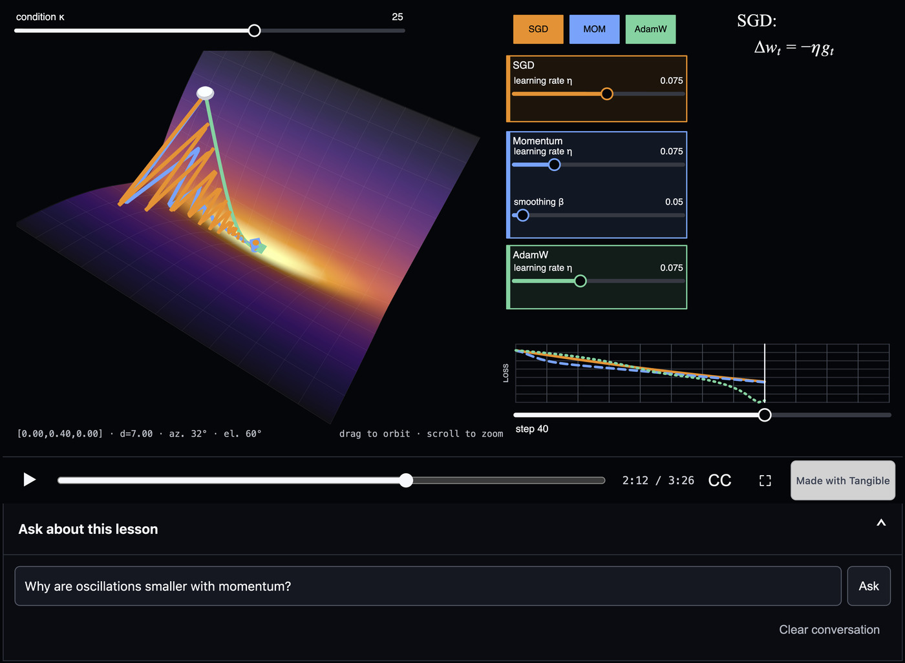

# Tangible

*Tangible* is **an open-source toolkit for creating narrated, interactive lessons**. 

Each lesson combines a scene that learners can manipulate with spoken explanation and synchronized visual changes. Lessons can also include an AI assistant that answers questions and demonstrates ideas directly in the scene, and they can be published as 🤗 Hugging Face Spaces.

For an example, open [“Why adaptive optimizers exist”](https://huggingface.co/spaces/dlouapre/tangible-optimizers) on Hugging Face Spaces. The lesson lets you play or seek through the explanation, orbit the loss landscape, move the starting point, change optimizer settings, pause for exploration, and ask written questions to an LLM assistant.

<p align="center">

</p>

Browse the public [Tangible lessons collection](https://huggingface.co/collections/dlouapre/tangible-lessons-6a96e2c4be1533d68e65d7a2) to find lessons published from this repository and by other creators.


## How does it work?

A lesson is built from a TypeScript interactive scene, a Markdown script file containing narration and scene synchronization, and a YAML configuration file. The scene is an ordinary TypeScript module that runs in the browser, so you can draw it with the DOM, with SVG, with a 2D canvas, or in three dimensions with WebGL through Three.js. The compiler creates an audio track using a Text-To-Speech model (TTS), and synchronizes it to a scene manipulation track. 

During playback, the scene combines scripted changes with learner interaction. When the LLM assistant is asked a question, it receives the script of the lesson, the state of the scene and instructions to control it.

Every scene renders from the lesson's parameters at the current lesson time. Seeking directly to a time therefore recreates the same view without replaying the lesson from the beginning.


## Requirements and installation

Writing a lesson, previewing its scene, and reviewing it with silent narration require nothing more than Node.js 22 or newer, Git, and pnpm. Node 22 includes Corepack, which can activate the pnpm version pinned by the repository:

```bash
git clone https://github.com/scienceetonnante/tangible.git
cd tangible
corepack enable
pnpm install
pnpm build
```
If your Node installation does not include Corepack, follow the
[official pnpm installation guide](https://pnpm.io/installation).

You can check that everything works by starting one of the example lessons in silent mode (see below):
```bash
pnpm lesson preview --silent --lesson lessons/optimizers
```

Open the local address printed by the command, press Start, and enable captions.
Try the controls, pause, seek, and resume. Stop the preview with `Ctrl+C`.
This requires no FFmpeg, speech model, or API key.

For an example with two scenes, run
`pnpm lesson preview --silent --lesson lessons/unit-circle`. Move the red point
or angle slider and follow the circle, cosine graph, and return to the circle.
The [multiple-scene walkthrough](./DOCUMENTATION.md#add-another-scene) explains
how those modules are registered and selected with `@scene(...)`.

Three further requirements matter only at specific steps, so you can install them when you reach those steps:

- FFmpeg, for the audible offline preview of step 4;
- an API key for the speech provider and for the assistant, as described in the next section;
- the Hugging Face command line tool `hf`, to publish a lesson as a Space in step 6.


## Credentials

Most of the work needs no account at all. The scene preview, `pnpm lesson check`, the silent preview, and the audible offline preview all run on your own machine. The currently supported production speech providers and the optional LLM assistant need credentials. Narration is generated during the build; learners play the resulting audio files without calling the speech provider.

Tangible reads these keys from a `.env` file, which it looks for both in the repository root and in the lesson directory. That file is listed in `.gitignore`, and the keys never reach the browser: they are used when the narration is compiled and, for the assistant, by a small server that runs beside the lesson.

- The production voice reads `ELEVENLABS_API_KEY` when `lesson.yaml` sets `tts.provider: elevenlabs`, or `TTS_ENDPOINT_URL` together with `HF_TTS_TOKEN` when it sets `tts.provider: hf-endpoint`. The latter expects a specific Qwen server protocol; it does not accept every Hugging Face TTS endpoint. Its token falls back to `HF_TOKEN` if `HF_TTS_TOKEN` is unset.
- The assistant reads `HF_TOKEN`. The same token must also be added as a secret of the Hugging Face Space once the lesson is deployed.

The [narration guide](./DOCUMENTATION.md#choose-and-configure-narration) gives complete configuration examples and explains timing, caching, and credentials.


## Build your own lesson

Authoring a lesson involves:

- building an interactive scene in `scenes/scene.ts`;
- writing the `script.md` file, which contains both the narration and the instructions for the synchronized manipulation of the scene;
- writing the `assistant.md` file for custom instructions to the LLM assistant (optional);
- adjusting the `lesson.yaml` configuration file to customize TTS model, assistant LLM and deployment parameters.

You can follow the steps below manually or with a coding agent. Agents that
support repository-local skills can use the
[create-tangible-lesson skill](./.agents/skills/create-tangible-lesson/SKILL.md).
Other agents can read `AGENTS.md`, `lessons/AGENTS.md`, and
[DOCUMENTATION.md](./DOCUMENTATION.md).

For an agent, copy this prompt and replace the bracketed text:

> Use `$create-tangible-lesson` and help me create a lesson about [subject]. The
> relationship I want learners to see is [relationship]. Build the smallest
> interactive scene first and stop for my review. Preserve my narration, turn
> my double-bracket hints into formal cues, and do not deploy until I explicitly
> authorize it.

You own the teaching argument, spoken narration, and final visual judgment.
The agent implements the scene, translates hints after scene review, runs
checks, and prepares builds. Production narration and deployment follow once
the lesson is stable.

### 1. Create a new lesson

First create a new lesson with
```bash
pnpm lesson new my-lesson --lesson lessons/my-lesson
```

The generated lesson already contains a scene, a range control, narration, a
synchronized cue, and a pause. It has no assistant, deployment target, or
production speech provider. You can complete the scene and silent narration
exercise without paid credentials.

### 2. Build the interactive scene

Build your interactive scene in `scenes/scene.ts` (possibly with a coding agent).

Preview the scene with
```bash
pnpm lesson scene --lesson lessons/my-lesson
```

Move the Amount slider: the number and bar should update together. This preview
does not read narration or contact a provider. In
`lessons/my-lesson/scenes/scene.ts`, change the `amount` parameter's default
from `30` to `50`, and replace the heading “One value, one visible result”
with words related to your subject. The running preview reloads automatically.

### 3. Write the script and the choreography

The `script.md` file contains both your narration and instructions for synchronized manipulations of the scene, for instance:

```
@camera(target: [0, 0.4, 0], distance: 7.4, azimuth: 7°, elevation: 62°, over: 3s) 
Now watch the orange path.

@cue(step -> 30, over: 5s) 
Each step crosses the ravine, overshoots, crosses back, and only slowly 
makes progress along the floor.
```

Start with your text, then add instructions for the choreography. You can either do it manually or use a coding agent.

Ordinary prose is spoken and becomes captions. Directives beginning with `@`
and double-bracket hints are silent. To try a small edit in the starter, find:

```markdown
Then it @cue(amount -> 80, over: 2s) grows, and the bar responds immediately.
[[Keep the bar change aligned with the word "grows".]]
```

Change one spoken sentence and change the cue target from `80` to `60`, keeping
the cue beside the word it supports. Also replace the starter's pause prompt
with an observation or prediction suited to your subject:

```markdown
@pause(prompt: "Move the slider and notice how the number and bar stay connected.")
```

#### Manually
Keywords for the choreography are documented in the [reference appendix](./DOCUMENTATION.md#narration-directives).
Before writing formal cues, run `pnpm lesson ref` to see exactly what the scene exposes.
```bash
pnpm lesson ref --lesson lessons/my-lesson
```
It prints the scene’s parameters, valid ranges, default values, ownership rules, camera presets, constants, groups, and other available
controls. 

For the starter exercise, confirm that it lists `amount`, its range from 0 to
100, and your new default.

#### With a coding agent
You can also first write the visual intentions in double brackets and ask your coding agent to translate them into formal directives.
```
[[Move to an overhead view before the next sentence.]]
Now watch the orange path.

[[Advance the optimizer to step 30 during the next sentence.]]
Each step crosses the ravine, overshoots, crosses back, and only slowly 
makes progress along the floor.
```


### 4. Check and iterate

Check your lesson with
```bash
pnpm lesson check --lesson lessons/my-lesson
```

To review your lesson while you are building it, you have three options: silent preview, audible offline and production voice.

You can first generate a silent preview version: activate closed captions and follow the choreography to see if it matches your intent.
```bash
pnpm lesson preview --silent --lesson lessons/my-lesson
```

Replace the `--silent` flag with `--offline` to get an audible offline preview
with Supertonic 3. Install FFmpeg through your operating system's package manager
and confirm that `ffmpeg -version` works. The first preview downloads a pinned
123 MB model; later previews reuse it. It needs no API key and calls neither
a hosted speech provider nor a hosted assistant. Its word timings are approximate.
```bash
pnpm lesson preview --offline --lesson lessons/my-lesson
```

To use the production voice, meaning the TTS model defined in `lesson.yaml`, you need the provider key described above:
```bash
pnpm lesson preview --lesson lessons/my-lesson
```

### 5. Build and review the finished lesson

For the starter exercise, build a complete site with silent narration and inspect
its state and a representative frame:

```bash
pnpm lesson build --silent --bundle --lesson lessons/my-lesson
pnpm lesson state --lesson lessons/my-lesson --at 30
pnpm lesson frame --lesson lessons/my-lesson --at 30 -o /tmp/my-lesson.png
```

You have now changed a scene, narration, and cue and built a complete lesson
without a credential or model download. When the configured production voice is
ready, compile it into `lessons/my-lesson/build/site/`:
```bash
pnpm lesson build --bundle --lesson lessons/my-lesson
```

Then review that bundle in your browser, as a visitor will see it, without rebuilding it:
```bash
pnpm lesson serve --lesson lessons/my-lesson
```


### 6. Publish on Hugging Face Spaces

After reviewing the complete lesson with its production voice, prepare the local
Space metadata without contacting Hugging Face:

```bash
pnpm lesson deploy --prepare --space namespace/space-name --lesson lessons/my-lesson
```

Review and commit those files. Then authenticate, run the local release checks, and create the Space privately.

```bash
hf auth login
pnpm lesson deploy --dry-run --create --lesson lessons/my-lesson
pnpm lesson deploy --create --lesson lessons/my-lesson
```

Deployment uploads only the release artifact, waits for the Space to start, and
prints logs when startup fails. It never makes an existing Space public, changes
hardware, or replaces secrets. Review the private Space before changing its
visibility. The [deployment guide](./DOCUMENTATION.md#deploy-to-hugging-face-spaces)
explains production narration, assistant secrets, logs, and release checks.

Once your Space is public, you can ask the maintainers to add it to the
[Tangible lessons collection](https://huggingface.co/collections/dlouapre/tangible-lessons-6a96e2c4be1533d68e65d7a2)
by [opening a GitHub issue](https://github.com/scienceetonnante/tangible/issues/new)
with the Space URL. The collection accepts public lessons from any Hugging Face
account.


## Current scope and limitations

*Tangible* currently supports desktop and tablet layouts. Portrait phones ask visitors to rotate the device or use a larger screen. 
Phone landscape uses a compact layout that is still being refined.

Local previews require no paid service. Hosted narration may incur costs when
uncached audio is generated, and a dedicated endpoint can also incur hosting
costs while provisioned. Watching a lesson does not trigger speech synthesis.
The optional assistant incurs provider costs when learners ask questions.
Tangible currently permits deployment only with ElevenLabs or the compatible
Qwen endpoint; local production voices are planned but are not yet supported.


## Repository layout

- `packages/` contains the framework itself: the state model, the script compiler, the browser player, the speech adapters, the shared scene ingredients, and the `lesson` command line tool.
- `lessons/` contains the example lessons, and it is where your own lesson goes.
- `DOCUMENTATION.md` contains the authoring workflow and reference appendix.
- `CONTRIBUTING.md` contains framework guidance and the TTS improvement plan.
- `docs/assets/` contains images used by this README.
- `e2e/` contains the browser tests.

Run `pnpm lesson --help` to list the available commands, and `pnpm lesson help <command>` to see the main options of one of them.


## Documentation

- [Documentation](./DOCUMENTATION.md) covers scene design, narration, choreography, review, assistants, and deployment, with a complete command and format reference in its appendix.
- [Contributing](./CONTRIBUTING.md) explains how to work on lessons or the framework.


## Acknowledgements

Inspired by the [interactive explorables](https://eater.net/quaternions) of Ben Eater and Grant Sanderson, and the article by [Andy Matuschak](https://medium.com/khan-academy-early-product-development/narrated-explorables-three-mental-models-e16e0d80e4c1).

## License

*Tangible* is licensed under the [Apache License 2.0](./LICENSE).
